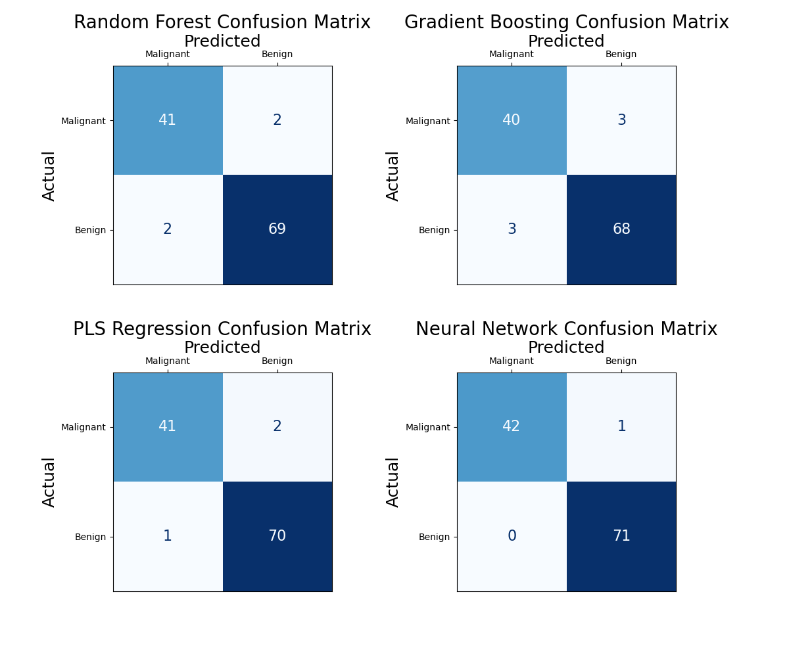
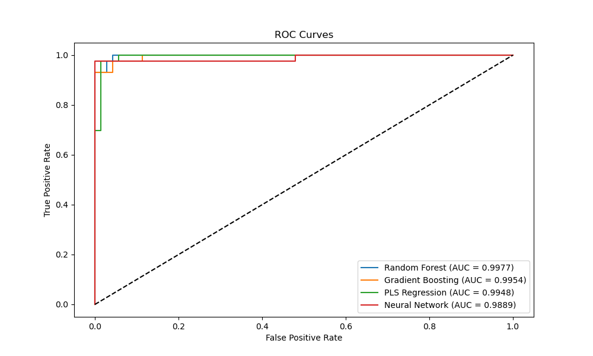

This repository demonstrates how to use machine learning models to predict breast cancer diagnosis using the Breast Cancer Wisconsin (Diagnostic) Dataset in Python. It includes data preprocessing, feature engineering, model training, and evaluation.

## Table of Contents

- [Dataset](#dataset)
- [Project Structure](#project-structure)
- [Usage](#usage)
- [Modeling](#modeling)
- [Evaluation](#evaluation)
- [Contributing](#contributing)
- [License](#license)

## Dataset

The Breast Cancer Wisconsin (Diagnostic) Dataset is sourced from the UCI Machine Learning Repository. It contains 569 data points with 30 features, including:

- `ID`: Unique identifier
- `Diagnosis`: Binary label indicating diagnosis (M = malignant, B = benign)
- `radius_mean`, `texture_mean`, `perimeter_mean`, `area_mean`, etc.: Various measurements of cell nuclei characteristics

### Citation of the Dataset

Wolberg,William, Mangasarian,Olvi, Street,Nick, and Street,W.. (1995). Breast Cancer Wisconsin (Diagnostic). UCI Machine Learning Repository. https://doi.org/10.24432/C5DW2B.

## Project Structure
Breast_Cancer_Diagnosis_ML/

```plaintext
Breast_Cancer_Diagnosis_ML/
├── data/
│   ├── breast_cancer_wisconsin.csv  # Raw dataset
├── notebooks/
│   ├── data_preprocessing.ipynb     # Data preprocessing and EDA
│   ├── feature_engineering.ipynb    # Feature engineering
│   ├── model_training.ipynb         # Model training and tuning
│   ├── model_evaluation.ipynb       # Model evaluation
├── scripts/
│   ├── preprocess.py                # Data preprocessing script
│   ├── features.py                  # Feature selection script
│   ├── train.py                     # Model training script
│   ├── evaluate.py                  # Model evaluation script
├── models/
│   ├── model.pkl                    # Trained model
├── results/
│   ├── evaluation_metrics.csv       # Evaluation metrics
│   ├── confusion_matrix.png         # Confusion matrix
├── README.md                        # Project README
```

## Usage

1. **Data Preprocessing**:
   - Execute the `data_preprocessing.ipynb` notebook to clean and preprocess the data.
   - [Data Preprocessing Notebook](notebooks/data_preprocessing.ipynb)

2. **Feature Engineering**:
   - Run the `feature_engineering.ipynb` notebook to create new features and select the most important ones.
   - [Feature Selection Notebook](notebooks/feature_selection.ipynb)

3. **Model Training**:
   - Use the `model_training.ipynb` notebook to train various machine learning models and tune hyperparameters.
   - [Model Training Notebook](notebooks/model_training.ipynb)

4. **Model Evaluation**:
   - Evaluate the performance of the trained models using the `model_evaluation.ipynb` notebook.
   - [Model Evaluation Notebook](notebooks/model_evaluation.ipynb)


## Modeling

The project explores various machine learning models, including:

- Random Forest (RF)
- Gradient Boosting (GB)
- Partial Least Squares (PLS)
- Neural Networks (NN)

The models are evaluated using cross-validation and tuned for optimal performance.

## Evaluation

Model performance is assessed using metrics such as:

- Accuracy
- Precision
- Recall
- F1-Score
- ROC-AUC

Visualizations include confusion matrices and ROC curves.

## Results

### Confusion Matrices



### ROC Curves



### Evaluation Metrics

| Model              | Accuracy | Precision | Recall  | F1 Score | ROC AUC | Confusion Matrix          |
|--------------------|----------|-----------|---------|----------|---------|---------------------------|
| Random Forest      | 0.964912 | 0.953488  | 0.953488| 0.953488 | 0.997707| `[[69, 2], [2, 41]]`      |
| Gradient Boosting  | 0.947368 | 0.930233  | 0.930233| 0.930233 | 0.995414| `[[68, 3], [3, 40]]`      |
| PLS Regression     | 0.973684 | 0.976190  | 0.953488| 0.964706 | 0.994759| `[[70, 1], [2, 41]]`      |
| Neural Network     | 0.991228 | 1.000000  | 0.976744| 0.988235 | 0.988863| `[[71, 0], [1, 42]]`      |

### Discussion and Conclusion

Based on the evaluation metrics and visualizations:

- The **Neural Network** model achieved the highest accuracy, precision, and F1 score, making it the best performing model in terms of overall performance.
- **Random Forest** and **PLS Regression** also performed very well, with high accuracy and balanced precision and recall scores.
- **Gradient Boosting** had the lowest accuracy and precision among the models, but still performed relatively well.
- **PLS Regression** requires considerably less tuning and computing resources compared to other models, making it a suitable choice for quick and efficient predictions.
- All models demonstrated high ROC AUC scores, indicating strong discriminative ability.

The results suggest that while the Neural Network model is the most accurate, the PLS Regression model is also a viable option when computational resources and tuning efforts are limited.

## Contributing

Contributions are welcome! Please create an issue or submit a pull request for any feature requests or improvements.

## License

This project is licensed under the MIT License.

If you use this repository in your research, please cite it as shown in the right sidebar.
